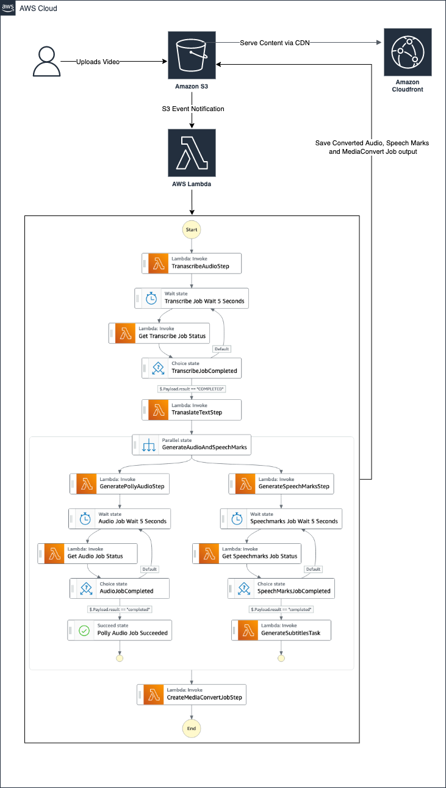

# Overview
This is sample solution that demonstrates how builders can use polly to generate audio different than the source audio, generate subtitles from a text file, generate speech marks and tie them all together. 

# Deploy

This demo can be deployed via CDK in your own AWS Account. 

###### Prerequisites
- [aws-cdk](https://docs.aws.amazon.com/cdk/latest/guide/getting_started.html) installed and [bootstrapped](https://docs.aws.amazon.com/cdk/latest/guide/bootstrapping.html)
- npm installed
- aws credentials configured

##### Input parameters
**pollyLanguageCode** - The polly target language code to which the audio needs to be converted to. [Click here](https://docs.aws.amazon.com/polly/latest/dg/SupportedLanguage.html) for list of eligible values.  
_Solution default value: 'es-US'_

**pollyVoiceId** - The polly voice id to be used for the converted audio. [Click here](https://docs.aws.amazon.com/polly/latest/dg/voicelist.html) for list of eligible values.  
_Solution default value: 'Miguel'_

**pollyEngine** - Polly Amazon Polly enables you to use either neural or standard voice with the engine property. It has two possible values: standard or neural.  
_Solution default value: 'standard'_

**mediaConvertLangShort** - Short language code to be used in MediaConvert Job for captioning.  
_Solution default value: SPA_

**mediaConvertLangLong** - Long language code to be used in MediaConvert Job for captioning.  
_Solution default value: Spanish_

**targetLanguageCode** - Target language code to which the audio and subtitles needs to be generated.  
_Solution default value: es_

Deploy solution using default values
```
cdk deploy
```

Deploy solution using by overriding default values, for e.g, for converting video to Hindi language
```
cdk deploy --parameters pollyLanguageCode=hi-IN --parameters pollyVoiceId=Aditi --parameters pollyEngine=standard --parameters mediaConvertLangShort=HIN --parameters mediaConvertLangLong=Hindi --parameters targetLanguageCode=hi
```

**Note:** The deployment takes few minutes to complete

# How it works


1.  Once the CDK is deployed, to test the solution, you can upload a video(.mp4) into the <S3_ROOT_BUCKET>/inputVideo/, for e.g., s3://pollyblogcdkstack-pollyblogbucket9110****-*****/inputVideo/. 
2. After successfully uploading the video, S3 object creation event triggers a lambda which kicks off a state machine execution. To see the progress of the execution, navigate to Step Functions -> State machines from the admin console and search for state machine name that starts with 'ProcessAudioWithSubtitles'.  
3. The first step of the state machine is to take the input video and generate transcription using [Amazon Transcribe](https://aws.amazon.com/transcribe/). 
4. Once the transcription job is complete, it then uses [Amazon Translate](https://aws.amazon.com/translate/) to translate the text to target language passed in via input parameters.  
5. It the starts 2 parallel flows for generating audio and speech marks for the target language passed via input parameters.
    - Generate [polly audio](https://docs.aws.amazon.com/polly/latest/dg/voicelist.html) 
    - Generate [polly speech marks](https://docs.aws.amazon.com/polly/latest/dg/speechmarks.html)
6. Once the parallel steps are complete, the final step is to tie them all together with [MediaCovert](https://aws.amazon.com/mediaconvert/). A simple mediaconvert settings file is included as part of the codebase.

# Cleanup
To remove all deployed resources
```
cdk destroy
```
Please make sure to delete S3 buckets that are created as part of the solution to avoid any unnecessary storage costs.

# Contributors  
Reagan Rosario (reagaros@amazon.com)  
Matthew Juliana (mattjul@amazon.com)  
Anil Kodali (akodali@amazon.com)  
Prasanna Saraswathi Krishnan (pskrish@amazon.com)  
Justin Haydt (jjhaydt@amazon.com)  

If you are interested in contributing, please refer to contributing guidelines [here](/CONTRIBUTING.md).